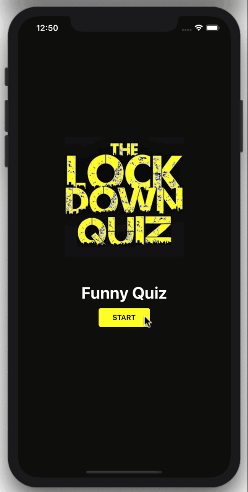

# Ứng dụng quiz

- Tính năng: Ứng dụng trả lời câu hỏi trắc nghiệm, tính thời gian, kiểm tra số câu trả lời đúng

## Kiến thức áp dụng
- Sử dụng các component: StatusBar, SafeAreaView, Dimensions, View, Text, TouchableOpacity, FlastList, Image
- Sử dụng thư viện NavigatorContainer trong điều hướng màn hình
- Sử dụng route của NavigatorContainer để truyền dữ liệu
- Sử dụng >useState< 
- Sử dụng useEffect

## Demo

